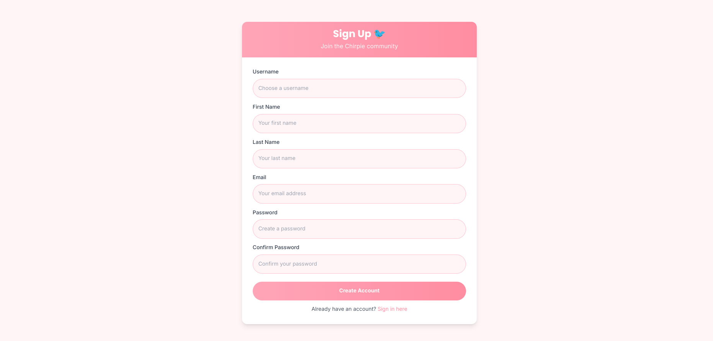
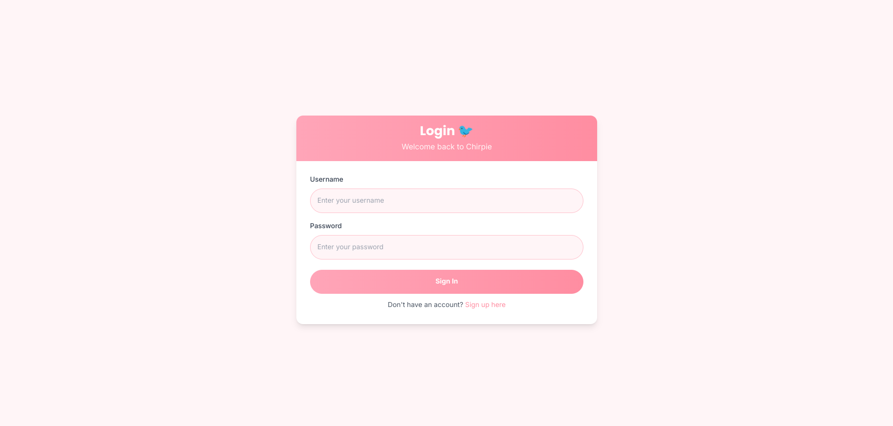
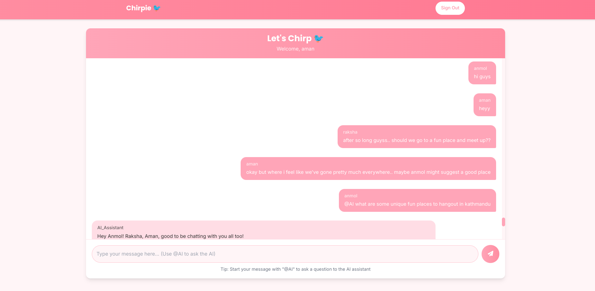
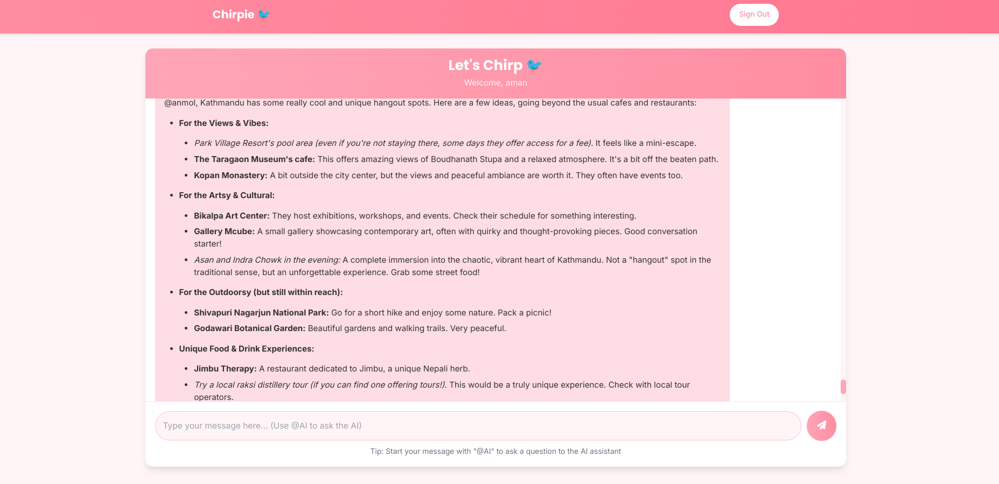
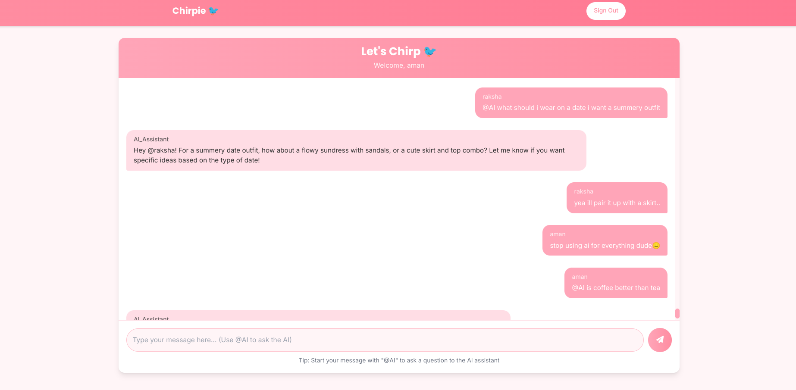

# Chirpie 🐦

Chirpie is a Django-based web application that allows users to join group chats where they can interact with AI. The AI responds to messages that start with `@AI`. The application includes login and signup authentication.


## Features
- **Group Chat**: Users can join group chats and communicate in real-time.
- **AI Interaction**: Messages starting with `@AI` are responded to by the AI using the Gemini API.
- **User Authentication**: Login and signup functionality for users.
- **Real-Time Communication**: WebSockets are used to provide real-time chat features.

## Screenshots

### Sign Up Page


### Login Page


### Group Chat





## Technologies Used
- **Django**: Backend framework for the application.
- **WebSockets**: For real-time messaging.
- **Gemini API**: To interact with the AI for automated responses.
- **JavaScript (with Django Channels)**: To manage WebSocket connections.
- **PostgreSQL**: Database for storing user credentials and chat messages.

## Setup

1. Clone the repository:

   ```bash
   git clone https://github.com/Raksha-Karn/Chirpie-TwoInOne.git
2. Install the dependencies:
    ```bash
    pip install -r requirements.txt
    ```
4. Setup Gemini Api Key and Database Config in .env file.
5. Run the server:
    ```bash
    watchfiles "daphne -b 0.0.0.0 -p 8001 core.asgi:application"
    ```
5. Visit `http://localhost:8001` in the browser.
